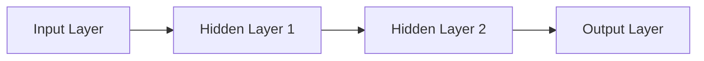
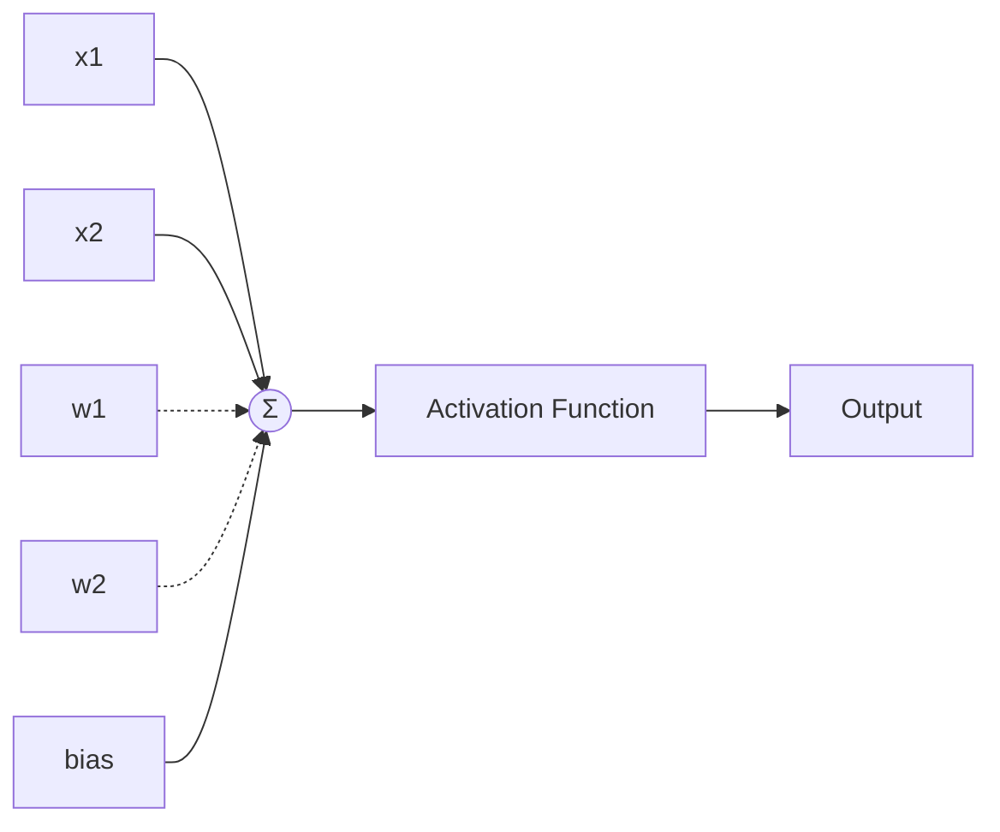
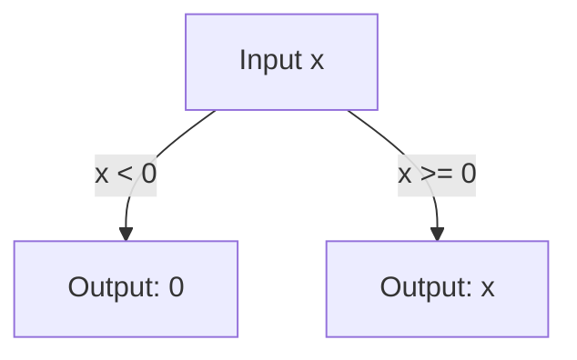

# Deep Learning Overview

Deep Learning is a specialized subset of Machine Learning that uses artificial neural networks with many layers to learn patterns from large amounts of data. It is especially powerful for tasks involving images, audio, text, and complex patterns.

---

## 🧠 What Is Deep Learning?

Deep learning models are inspired by the human brain. They consist of many layers of interconnected nodes (neurons) that learn to represent data at increasing levels of abstraction.

---

## 🌍 Where Is Deep Learning Used?

- **Image recognition:** Identifying objects in photos
- **Speech recognition:** Voice assistants
- **Natural language processing:** Chatbots, translation
- **Self-driving cars:** Detecting lanes, pedestrians
- **Medical imaging:** Detecting tumors
- **Recommendation systems:** Video, product recommendations

---

## 🔗 What Are Neural Networks?

A neural network is a system of layers made up of nodes (neurons). Each neuron receives inputs, multiplies them by weights, applies an activation function, and passes the result forward.

---

### 🏗️ Structure of a Neural Network

A basic neural network contains:

1. **Input Layer:** Takes the raw data (e.g., pixel values of an image).
2. **Hidden Layers:** Transform the input into meaningful patterns. More layers = deeper learning.
3. **Output Layer:** Produces the final prediction (e.g., class probabilities or numeric output).

**Diagram: Basic Neural Network Structure**



---

### 🐾 Simple Example

Imagine a network that predicts whether an image is a cat or not.

- **Input layer:** image pixels
- **Hidden layers:** detect edges, shapes, textures
- **Output layer:** 1 neuron giving probability "cat or not"

---

## ⚡ How Neurons Work

Each neuron has:
- **Inputs:** Data from previous layer
- **Weights:** Parameters that determine importance
- **Bias:** Adjustment term
- **Activation function:** e.g., ReLU, sigmoid

**Neuron computation:**

```
output = activation(W1*x1 + W2*x2 + ... + b)
```

**Diagram: Single Neuron**



---

## 🔑 Understanding Weights and Parameters

- **Large positive weight:** strong influence
- **Near-zero weight:** weak influence
- **Negative weight:** inhibitory influence

**Training** = adjusting weights to reduce error.

---

## 🔄 Forward Propagation

Forward propagation is the process of passing input data through the network to get a prediction.

**Example:**
- Input: 2 features → [x1, x2]
- Weights: [w1, w2]
- Bias: b
- Activation: ReLU

```
Neuron output = ReLU(w1*x1 + w2*x2 + b)
```

This happens layer by layer until the output layer produces the final result.

---

## 🔁 Backward Propagation (Backpropagation)

Backward propagation adjusts weights based on the error between prediction and actual value.

**How it works:**
1. Compute error at the output.
2. Calculate how much each weight contributed to the error (gradient).
3. Update weights using gradient descent.

**Simple Example:**
- If the prediction is very wrong:
  - The error is large
  - Gradients are large
  - Weights get updated significantly

This cycle repeats many times during training.

---

## 🧩 Popular Deep Learning Architectures

1. **Convolutional Neural Networks (CNNs):**  
   Best for images, videos (object detection, facial recognition, medical imaging)

2. **Recurrent Neural Networks (RNNs):**  
   Best for sequences (speech, time-series, text)

3. **LSTMs & GRUs:**  
   Improved RNNs for long sequences (translation, chatbots)

4. **Transformers:**  
   State-of-the-art for language and vision (GPT, BERT, image transformers)

5. **Autoencoders:**  
   Dimensionality reduction, anomaly detection

6. **GANs:**  
   Generate new images, audio, synthetic data

---

## 🧮 Activation Functions: ReLU and Sigmoid

### **ReLU (Rectified Linear Unit)**

- **Formula:** `ReLU(x) = max(0, x)`
- **Behavior:** Outputs 0 if input is negative, otherwise outputs the input.
- **Why use it?**  
  - Simple and efficient
  - Helps networks learn faster
  - Reduces vanishing gradient problem

**Diagram: ReLU Activation**



---

### **Sigmoid**

- **Formula:** `Sigmoid(x) = 1 / (1 + exp(-x))`
- **Behavior:** Maps input to a value between 0 and 1.
- **Why use it?**  
  - Good for binary classification (probabilities)
  - Smooth gradient

**Diagram: Sigmoid Activation**

```mermaid
flowchart TD
    X[Input x] --> S[Sigmoid Function: 1/(1+exp(-x))]
    S --> Y[Output (0 to 1)]
```
---

## 🛠️ Tools & Technologies in Deep Learning

**Frameworks:**
- TensorFlow
- Keras
- PyTorch
- JAX

**Tools:**
- TensorBoard
- Weights & Biases
- OpenCV (vision tasks)

---

*Deep Learning enables machines to solve complex problems by learning from data, using powerful neural network architectures and efficient training techniques!*